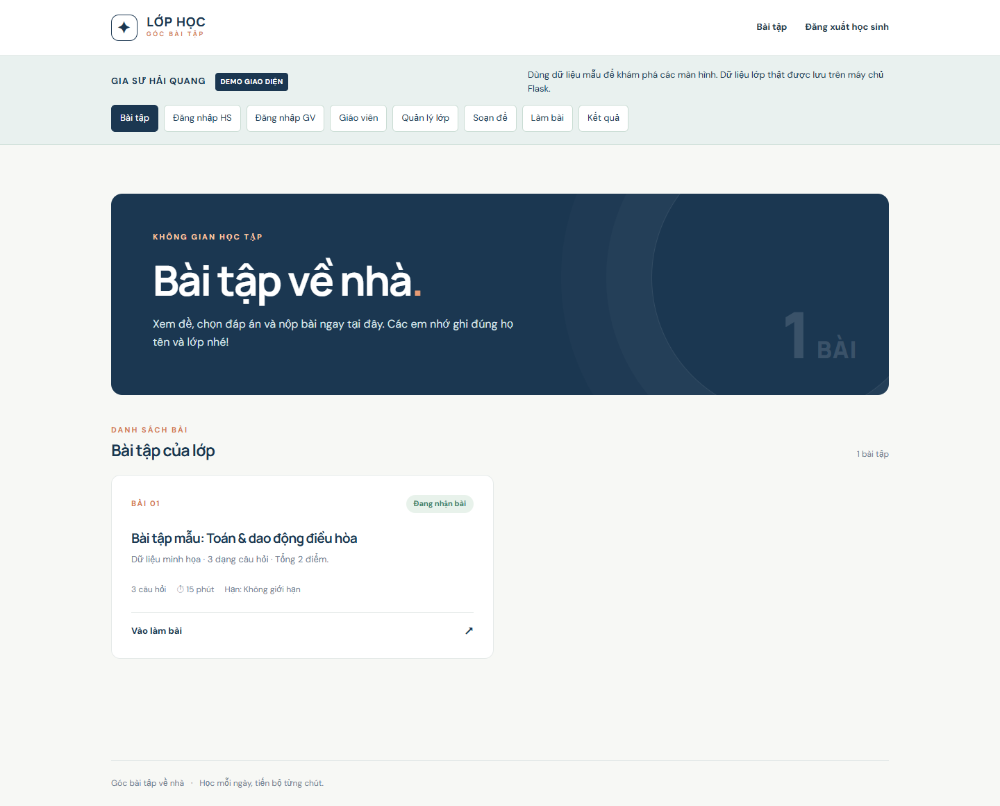
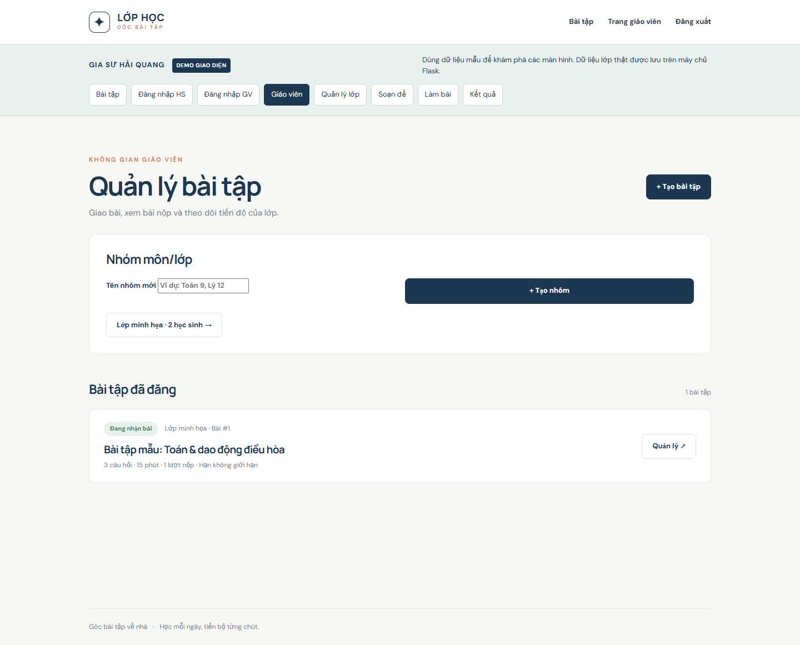

# gia-su-hai-quang-education

Website giao bài tập về nhà cho Gia sư Hải Quang.

## Xem giao diện ngay trên GitHub Pages

**[Mở website demo →](https://phamhaiquang2003-sudo.github.io/gia-su-hai-quang-education/)**

Trang demo hiển thị giao diện thật của dự án: bài tập học sinh, đăng nhập, trang giáo viên, quản lý lớp, theo dõi tiến độ, soạn đề với kho LaTeX/dán ảnh, làm bài có đồng hồ và xem kết quả. Dùng thanh điều hướng **DEMO GIAO DIỆN** để chuyển màn hình. Có thể làm thử đề mẫu và xem điểm được tính ngay trên trình duyệt.

GitHub Pages phục vụ bản giao diện tĩnh với dữ liệu minh họa. Đăng nhóm, cấp mã và lưu bài làm của lớp thật dùng ứng dụng Flask theo hướng dẫn bên dưới. Không nhập mật khẩu hoặc thông tin học sinh thật vào bản demo.

Các trang tĩnh được tạo từ chính `templates/` bằng `py scripts/build_pages.py`; sau khi sửa giao diện, chạy lại lệnh này rồi commit `index.html` và `demo/`. GitHub Pages dùng **Deploy from a branch → main → / (root)**; tệp `.nojekyll` và `index.html` giúp mở giao diện thay vì dựng README thành trang chủ.

### Giao diện học sinh



### Giao diện giáo viên



[Xem trang soạn đề](https://phamhaiquang2003-sudo.github.io/gia-su-hai-quang-education/demo/soan-de.html) · [Làm thử đề mẫu](https://phamhaiquang2003-sudo.github.io/gia-su-hai-quang-education/demo/lam-bai.html)

Website giao bài trắc nghiệm A–D, đúng/sai và trả lời ngắn. Giáo viên đặt điểm cho câu chọn đáp án/trả lời ngắn và thời gian làm bài; câu đúng/sai mới luôn có bốn ý, tối đa 1 điểm. Học sinh có thể nộp sớm dù chưa trả lời hết; hết giờ hệ thống chấm câu trả lời đã lưu. **PDF chỉ giáo viên xem được.**

## Chạy trên máy tính Windows

1. Cài Python từ [python.org](https://www.python.org/downloads/) và bật tùy chọn **Add Python to PATH** khi cài.
2. Nhấp đúp `chay-website.bat`. Lần đầu chương trình cài Flask; cửa sổ dòng lệnh cần **để mở** khi dùng website.
3. Trình duyệt tự mở **http://127.0.0.1:8000/giao-vien/dang-nhap** trên máy giáo viên. Lần đầu, hãy tạo mật khẩu giáo viên (ít nhất 10 ký tự) khi trang yêu cầu.
4. Đăng nhập giáo viên, tạo nhóm môn/lớp (ví dụ Toán 9, Lý 12), vào nhóm cấp mã riêng cho từng học sinh rồi chọn **Tạo bài tập**. Nếu còn bài cũ trong nhóm **Chung**, có thể chuyển bài sang nhóm mong muốn ở trang quản lý bài.

Có thể chạy bằng lệnh `py -m pip install -r requirements.txt` rồi `py app.py` trong thư mục này.

Kiểm tra luồng tạo bài, nộp bài và chấm điểm bằng lệnh `py -m unittest discover -s tests`.

## Lấy mã nguồn và cập nhật từ GitHub

```powershell
git clone https://github.com/phamhaiquang2003-sudo/gia-su-hai-quang-education.git
cd gia-su-hai-quang-education
py -m pip install -r requirements.txt
```

Để cập nhật bản đã clone, chạy `git pull --ff-only` trong thư mục dự án, sau đó khởi động lại website.

Kho GitHub lưu mã nguồn. Dữ liệu lớp, mật khẩu, bài làm, câu hỏi đã nhập và ảnh/PDF tải lên nằm trong `data/`, `questions/`, `uploads/` trên máy đang chạy và được bỏ qua bằng `.gitignore`. Khi chạy trên máy mới, ứng dụng tạo cơ sở dữ liệu mới; để chuyển lớp hiện có, sao lưu và chuyển riêng các thư mục dữ liệu này.

## Cách dùng

- **Học sinh:** Truy cập trang chủ, đăng nhập bằng mã `HS-...` giáo viên cấp, chỉ thấy bài của nhóm mình. Có thể làm tiếp trên thiết bị khác khi đăng nhập cùng mã. Chọn đáp án, đúng/sai cho từng ý hoặc điền trả lời ngắn; bài tự lưu khi thay đổi. Nộp sớm khi chưa trả lời hết được phép; câu trống nhận 0 điểm. Tải lại không đặt lại giờ. Sau khi nộp xem điểm, đáp án, và mở lại điểm tại trang bài tập. Mỗi mã chỉ nộp một lần cho mỗi bài.
- **Giáo viên:** Khi tạo bài chọn nhóm và từng dạng câu. Câu trắc nghiệm A–D/trả lời ngắn có thể nhập điểm 0,01–100. Câu đúng/sai mới cần đủ **4 ý**, cố định **1 điểm**: đúng 1 ý được **0,1**, đúng 2 ý **0,25**, đúng 3 ý **0,5**, đúng 4 ý **1**; bỏ trống hoặc sai không tính đúng. Bài đúng/sai tạo trước khi cập nhật vẫn giữ thang điểm cũ để không làm thay đổi kết quả đã nộp. Trả lời ngắn so khớp không phân biệt chữ hoa/thường, bỏ khoảng trắng thừa, và chấp nhận nhiều đáp án ngăn bởi dấu `;`. Điểm tổng là tổng điểm các câu. Có thể cấp lại mã nếu học sinh quên (mã cũ và phiên đăng nhập cũ hết hiệu lực), theo dõi từng em tại trang nhóm, xem và tải CSV điểm của từng bài. Với bài mẫu cũ, có thể sửa đáp án và điểm từng câu ở trang quản lý bài; điểm các bài đã nộp sẽ được chấm lại.
- **Công thức và ảnh:** Nút **∑ Công thức** ở ô câu hỏi, từng phương án A–D, từng ý đúng/sai và đáp án ngắn mở bảng chọn 111 ví dụ có tìm kiếm, xem trước và nhóm theo [bài hướng dẫn của MathVN](https://www.mathvn.com/2021/09/latex-co-ban-cach-go-cac-cong-thuc-ki.html). Công thức được chèn đúng vị trí con trỏ; có thể sửa ký tự mẫu hoặc gõ LaTeX trực tiếp giữa `\(...\)` và `\[...\]`. Ký hiệu Unicode (√, π, ≤, ∑, …) dán trực tiếp được. Nếu dùng LaTeX ở đáp án ngắn, hãy thêm cách viết chữ/số học sinh sẽ nhập sau dấu `;` (ví dụ `\(\frac{1}{2}\); 1/2; 0,5`) để chấm tự động. Chọn ảnh PNG/JPG/WebP/GIF hoặc dán ảnh từ clipboard bằng Ctrl+V ngay trong thẻ câu hỏi; tối đa 3 ảnh/câu, 3 MB/ảnh và 10 triệu pixel/ảnh. Ảnh chỉ hiện trong bài của nhóm, PDF vẫn chỉ giáo viên xem được. Bộ hiển thị công thức KaTeX đã nằm trong `static/vendor/katex/`, nên không cần kết nối CDN; công thức rộng có thể kéo ngang để xem.
- **Dán ảnh đã sao chép:** Nhấp vào ô **Nội dung câu hỏi** rồi nhấn **Ctrl+V**, hoặc bấm **Dán ảnh đã sao chép** trong chính câu đó. Ảnh từ clipboard PNG/JPG/WebP/GIF hoặc ảnh `data:` nằm trong HTML sao chép từ Word/trang web sẽ hiện ngay ở phần xem trước dưới ô nhập và dưới câu hỏi khi học sinh làm bài. Nếu clipboard chỉ chứa đường dẫn tệp ảnh nội bộ mà trình duyệt không đọc được, hãy dùng **Win+Shift+S** chụp vùng ảnh rồi Ctrl+V, hoặc chọn tệp ảnh. Khi sao chép cả đoạn chữ có ảnh, chữ tiếp tục được dán vào ô câu hỏi. Nút đọc clipboard cần trang `127.0.0.1` hoặc HTTPS; Ctrl+V vẫn sử dụng được ở địa chỉ LAN thông thường.
- **Xóa:** Trong trang của nhóm có nút xóa học sinh bên cạnh từng tên và nút xóa nhóm ở cuối trang. Trang quản lý từng bài có nút xóa bài tập ở cuối trang. Mỗi nút yêu cầu xác nhận: xóa học sinh sẽ xóa mã và lịch sử làm bài của em; xóa bài sẽ xóa mọi lượt làm, kết quả và tệp PDF/câu hỏi chỉ dùng cho bài đó; xóa nhóm sẽ xóa cả học sinh và bài tập trong nhóm cùng dữ liệu liên quan. Những nhóm và bài mẫu đã xóa sẽ không tự xuất hiện lại khi khởi động website.
- Dữ liệu nằm trong `data/homework.sqlite3`; mật khẩu giáo viên lưu dưới dạng mã băm. Nội dung câu hỏi nằm trong `questions/`, PDF giáo viên ở `uploads/`. Hãy sao lưu **cả thư mục** để giữ bài tập và kết quả.
- Hạn cuối và đồng hồ tính theo **giờ Việt Nam (GMT+7)** ở phía máy chủ. Nếu hạn cuối đến sớm hơn thời gian làm bài, bài sẽ kết thúc theo hạn cuối. Liên kết đăng nhập giáo viên yêu cầu mật khẩu giáo viên; mã học sinh không thể dùng để truy cập trang quản lý. Tạo mật khẩu giáo viên lần đầu phải thao tác trên chính máy chủ qua `127.0.0.1`.

## Mở trên điện thoại và thiết bị khác trong cùng Wi-Fi

Sau khi chạy `chay-website.bat`, cửa sổ máy chủ hiển thị dòng `Thiet bi cung Wi-Fi: http://<IP-cua-may>:8000`. Gửi **địa chỉ IP đó** cho học sinh, ví dụ `http://192.168.2.12:8000` khi Wi-Fi hiện tại cấp địa chỉ này. IP có thể đổi sau khi kết nối lại Wi-Fi. Giữ cửa sổ máy chủ mở và đảm bảo điện thoại dùng cùng mạng, không dùng mạng di động hoặc Wi-Fi khách có chế độ cách ly thiết bị.

Nếu máy chủ mở được trên chính máy giáo viên nhưng điện thoại không vào được:

1. Kiểm tra dòng `Thiet bi cung Wi-Fi` và thử mở địa chỉ đó ngay trên máy giáo viên.
2. Trên máy hiện tại, Wi-Fi đang là **Public** và Windows Firewall đang **BlockInbound**. Nếu đây là mạng tin cậy, vào **Windows Settings → Network & internet → Wi-Fi → mạng đang kết nối → Network profile type → Private**. Mở PowerShell **Run as administrator** và chạy:

   ```powershell
   New-NetFirewallRule -DisplayName "Website Bai Tap - LAN 8000" -Direction Inbound -Action Allow -Protocol TCP -LocalPort 8000 -Profile Private -RemoteAddress LocalSubnet
   ```

   Lệnh chỉ cho phép thiết bị trong mạng nội bộ vào cổng 8000 khi mạng ở chế độ Private. Nếu máy do trường/cơ quan quản lý và không cho áp dụng quy tắc tường lửa cục bộ, cần nhờ quản trị mạng mở cổng này.
3. Chạy lại `chay-website.bat` sau khi thay đổi. Không dùng `127.0.0.1:8000` trên điện thoại: đó là địa chỉ của chính điện thoại.

## Học sinh truy cập từ nhà / ngoài Wi-Fi

Địa chỉ LAN `192.168.x.x` chỉ dùng trong cùng mạng. Có thể thử **Cloudflare Tunnel** dưới đây để truy cập từ xa mà vẫn giữ dữ liệu trên máy giáo viên. Nếu cần đường dẫn và thời gian hoạt động ổn định, hãy triển khai website lên máy chủ có tên miền, HTTPS và ổ đĩa lưu dữ liệu (ví dụ VPS); địa chỉ LAN không tự trở thành địa chỉ công khai.

### Thử miễn phí mà vẫn lưu dữ liệu trên máy giáo viên

1. Mở `chay-website.bat` và giữ cửa sổ website chạy.
2. Mở `chay-tu-xa.bat`. Lần đầu script tải `cloudflared` từ [bản phát hành chính thức của Cloudflare](https://developers.cloudflare.com/cloudflare-one/connections/connect-networks/downloads/).
3. Sao chép địa chỉ `https://...trycloudflare.com` xuất hiện trong cửa sổ tunnel để thử trên điện thoại (có thể dùng mạng di động). **Không** gửi địa chỉ `127.0.0.1` hoặc `192.168.x.x` khi học sinh ở nhà.

Nếu đường dẫn bị trôi giữa các dòng nhật ký, nhấp đúp `xem-link-tu-xa.bat` để hiện liên kết hiện tại và tự sao chép vào bộ nhớ tạm. Dòng `Failed to initialize DNS local resolver` đôi khi xuất hiện sau khi tunnel kết nối; hãy kiểm tra liên kết thực tế trước khi kết luận tunnel bị lỗi.

Dữ liệu bài nộp và mật khẩu vẫn nằm trong `data/` trên máy này. Máy phải bật, cả hai cửa sổ phải chạy và kết nối Internet thông suốt; đóng tunnel thì liên kết ngừng hoạt động và lần chạy sau nhận một địa chỉ mới. Cloudflare gọi đây là **Quick Tunnel**, chỉ phù hợp để thử nghiệm và không đảm bảo đường dẫn cố định hay thời gian hoạt động; để dùng lâu dài cần tài khoản/tên miền và tunnel cấu hình cố định hoặc máy chủ riêng.

Trước khi chia sẻ liên kết công khai, hãy **tạo mật khẩu giáo viên** ở máy chủ và bảo vệ thư mục `data/`, `questions/` và `uploads/` (chỉ ứng dụng cần đọc chúng). Không chia sẻ mã nguồn `app.py` cho học sinh vì có đáp án mẫu ở đó.
